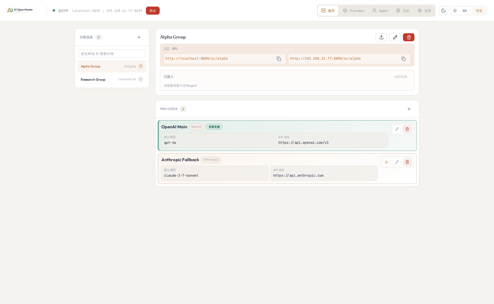
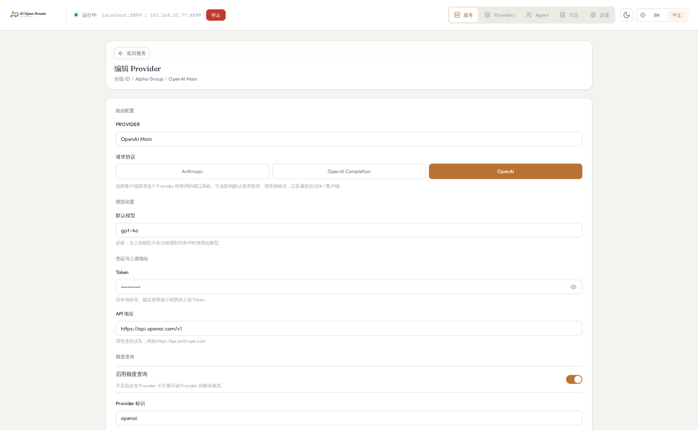
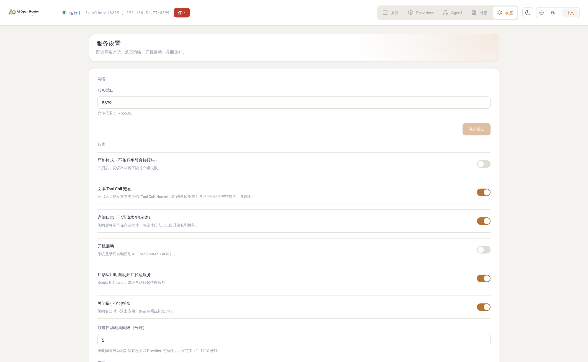
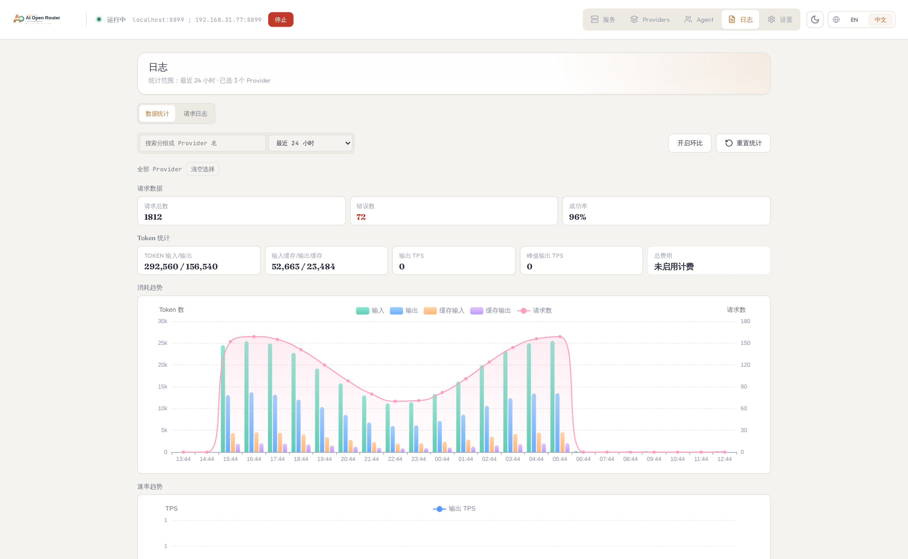
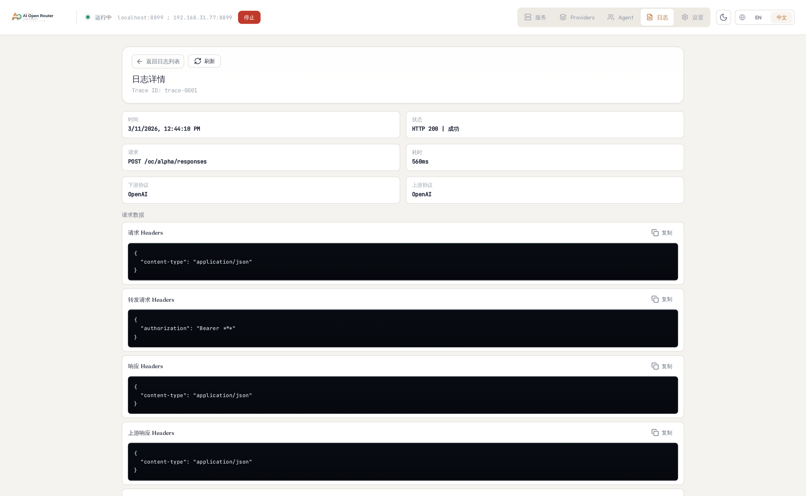

# AI Open Router

A desktop local AI gateway for **protocol switching, token/quota stats, cloud backup, and auto updates**.

中文文档: [docs/zh/README.md](docs/zh/README.md)

## Why AI Open Router

- Keep one stable local endpoint while switching upstream providers.
- Route by group and toggle active provider instantly.
- Track token usage and request quality in one place.
- Back up and restore routing configs with Remote Git.
- Auto-update the desktop app from GitHub Releases.

## Core Features

| Feature | Value | Where |
| --- | --- | --- |
| Protocol switching | Bridge OpenAI-compatible and Anthropic request styles | Service page |
| Quota stats | Show per-provider quota status (`ok` / `low` / `empty`) | Provider cards |
| Token stats | Inspect per-request usage and aggregated trends | Logs page |
| Cloud backup (Git) | Upload/pull group+provider backups with conflict confirmation | Settings page |
| Auto updates | Check GitHub Releases and install updates automatically | Settings page |

## 3-Minute Quick Start

### 1) Run the app (from source)

```bash
npm install
npm start
```

Default bind: `0.0.0.0:8899`
- `http://localhost:8899`
- `http://<your-lan-ip>:8899`

### 2) Create a group

1. Open Service page and create a group (for example: `claude`).
2. Set accepted model keys for the group.
3. The group route prefix becomes `/oc/<groupId>`.

### 3) Add a provider and switch protocol

1. Add a provider under that group.
2. Set `protocol`, `token`, upstream API base URL, and default model.
3. Activate that provider for the group (`activeProviderId`).

### 4) Send one request

```bash
curl http://localhost:8899/oc/claude/chat/completions \
  -H "Content-Type: application/json" \
  -d '{
    "model": "claude-3-5-sonnet",
    "messages": [{"role":"user","content":"hi"}]
  }'
```

If local auth is enabled, include:

```http
Authorization: Bearer <server.localBearerToken>
```

### 5) Verify success

- A new successful request appears in Logs.
- Log detail shows payload and token usage.
- Stats summary updates (requests/errors/success rate/token metrics).

## Feature Details

### Protocol Switching

- Group path routing: `/oc/:groupId/...`
- Supported entry endpoints:
  - `POST /oc/:groupId/chat/completions`
  - `POST /oc/:groupId/responses`
  - `POST /oc/:groupId/messages`
- `POST /oc/:groupId` falls back to chat-completions
- Per request flow:
  1. Resolve `groupId` from path
  2. Find group + `activeProviderId`
  3. Forward with active provider
  4. Translate payloads based on entry protocol and provider protocol

### Quota Stats

Per-provider quota query supports:
- `endpoint`, `method`, `authHeader`, `authScheme`
- `useRuleToken` / `customToken`
- `response.remaining`, `response.total`, `response.unit`, `response.resetAt`
- `lowThresholdPercent`

Mapping examples:

```json
{
  "response": {
    "remaining": "$.data.remaining_balance",
    "unit": "$.data.currency",
    "total": "$.data.total_balance",
    "resetAt": "$.data.reset_at"
  }
}
```

```json
{
  "response": {
    "remaining": "$.data.remaining_balance/$.data.remaining_total",
    "unit": "$.data.unit"
  }
}
```

Expressions support numeric literals, `+ - * /`, parentheses, and JSONPath-style references only.

### Token Stats

- Real-time logs include status, protocol direction, upstream target, and token usage.
- Aggregated stats can be filtered by time range and provider.
- Log details support headers/bodies/errors (when `logging.captureBody` is enabled).

### Cloud Backup (Remote Git)

In Settings, configure `repo URL + token + branch` to:
- Upload local backup as `groups-rules-backup.json`
- Pull remote backup to local state
- Confirm before overwriting when timestamp conflicts are detected

### Auto Updates

In Settings, enable auto updates to:
- Check GitHub Releases for new versions
- Download and install updates in the background
- See release notes before installing

## Screenshots

### Service (routing + active provider)



### Group editor


### Provider editor (quota mapping)



### Settings (cloud backup + updates)



### Logs and token stats



### Log detail



## FAQ

### Do I need to change my client code?

Usually no. In most cases, only the base URL changes to `http://localhost:8899/oc/:groupId/...`.

### Can one group have multiple providers?

Yes. A group can keep multiple providers, but only one is active at a time.

### Will remote pull overwrite local config?

Yes. Pull/import replaces current groups and providers, so export a local backup first.

### How are tokens stored?

Provider tokens and Remote Git token are currently stored locally in plain text. Use minimum-scope credentials.

## Docs for Developers

- `docs/dev-database.md`
- `docs/release-process.md`
- `docs/tauri-architecture.md`

## Development Commands

```bash
npm run check
npm run test
npm run ci
```

## Regenerate Screenshots (Playwright + Tauri Mock)

```bash
npm run screenshots:mock
```

Generated files:
- `docs/assets/screenshots/service-page.png`
- `docs/assets/screenshots/group-edit-page.png`
- `docs/assets/screenshots/rule-edit-page.png`
- `docs/assets/screenshots/settings-page.png`
- `docs/assets/screenshots/logs-page.png`
- `docs/assets/screenshots/log-detail-page.png`
