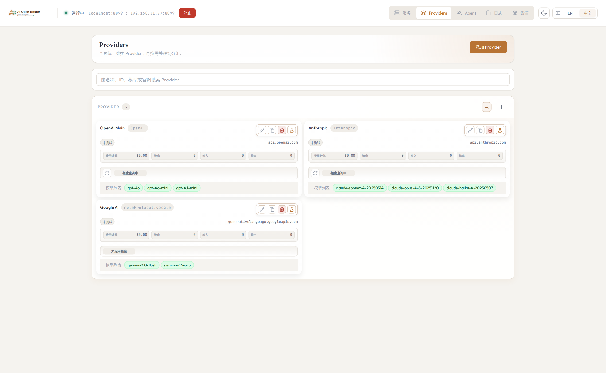

# AI Open Router

A desktop local AI gateway for **protocol switching, fuzzy routing, quota monitoring, and cloud backup**.

中文文档: [docs/zh/README.md](docs/zh/README.md)

## Why AI Open Router

- Keep one stable local endpoint while switching upstream providers.
- Route requests with fuzzy matching + longest-match algorithm.
- Track token usage and quota status per provider.
- Back up and restore configs with Remote Git.
- Auto-update the desktop app from GitHub Releases.

## Core Features

| Feature | Description | Where |
| --- | --- | --- |
| Fuzzy routing | Match requests using fuzzy contains + longest-match | Service page |
| Protocol switching | Bridge OpenAI, Anthropic, Google request styles | Automatic |
| Quota monitoring | Show per-provider quota status (`ok` / `low` / `empty`) | Provider cards |
| Token stats | Inspect per-request usage and aggregated trends | Logs page |
| Cloud backup (Git) | Upload/pull configs with conflict confirmation | Settings page |
| Auto updates | Check GitHub Releases and install automatically | Settings page |

## 3-Minute Quick Start

### 1) Launch the app

Open the desktop app from your system launcher.

### 2) Add providers

1. Go to the **Providers** page.
2. Add your API providers with protocol, token, and API endpoint.
3. Test connectivity to ensure providers work.

### 3) Create groups with routing rules

1. Open the **Service** page and create a group (e.g., `alpha`).
2. In the routing table, define rules:
   - `default` → routes unmatched requests
   - `claude*` → routes Claude model requests
   - `gpt-4*` → routes GPT-4 requests
3. The group route prefix becomes `/oc/<groupId>/...`.

### 4) Write config to your agent

Use the integration panel to write the group config into your agent (Claude Code, Codex, or OpenCode).

### 5) Switch provider later

Update the routing table in your group to point to a different provider.

## Feature Details

### Fuzzy Routing

Request matching uses a two-step algorithm:
1. **Fuzzy contains**: Check if the request model contains any rule pattern (e.g., `claude*` matches `claude-3-5-sonnet`)
2. **Longest match**: If multiple patterns match, use the longest one

Example routing table:
```
default      → OpenAI Main (gpt-4o)
claude*      → Anthropic (claude-sonnet-4)
gemini*      → Google AI (gemini-2.0-flash)
```

### Protocol Switching

- Group path routing: `/oc/:groupId/...`
- Supported entry endpoints:
  - `POST /oc/:groupId/chat/completions`
  - `POST /oc/:groupId/responses`
  - `POST /oc/:groupId/messages`
- `POST /oc/:groupId` falls back to chat-completions
- Per request flow:
  1. Resolve `groupId` from path
  2. Find matching route using fuzzy + longest-match
  3. Forward with target provider
  4. Translate payloads based on entry and provider protocols

### Quota Monitoring

Per-provider quota query supports:
- `endpoint`, `method`, `authHeader`, `authScheme`
- `useRuleToken` / `customToken`
- `response.remaining`, `response.total`, `response.unit`, `response.resetAt`
- `lowThresholdPercent`

Mapping examples:

```json
{
  "response": {
    "remaining": "$.data.remaining_balance",
    "unit": "$.data.currency",
    "total": "$.data.total_balance",
    "resetAt": "$.data.reset_at"
  }
}
```

Expressions support numeric literals, `+ - * /`, parentheses, and JSONPath-style references.

### Token Stats

- Real-time logs include status, protocol direction, upstream target, and token usage.
- Aggregated stats can be filtered by time range and provider.
- Log details support headers/bodies/errors (when `logging.captureBody` is enabled).

### Cloud Backup (Remote Git)

In Settings, configure `repo URL + token + branch` to:
- Upload local backup as `groups-rules-backup.json`
- Pull remote backup to local state
- Confirm before overwriting when timestamp conflicts are detected

### Auto Updates

In Settings, enable auto updates to:
- Check GitHub Releases for new versions
- Download and install updates in the background
- See release notes before installing

## Screenshots

### Service (group routing)


### Global Providers



### Settings (cloud backup + updates)


### Logs and token stats


### Log detail


## FAQ

### Do I need to change my client code?

Usually no. In most cases, only the base URL changes to `http://localhost:8899/oc/:groupId/...`.

### How does fuzzy routing work?

The router checks if your request model contains any rule pattern. For example:
- Request model `claude-3-5-sonnet-20240620` matches pattern `claude*`
- If multiple patterns match, the longest pattern wins

### Will remote pull overwrite local config?

Yes. Pull/import replaces current groups and providers, so export a local backup first.

### Why can't Linux root mode find my Claude/OpenClaw config?

From `v0.2.15`, when the app runs with `HOME=/root`, integration auto-detects root-level hidden config directories if the usual home path is missing:

- `/.claude` when `/root/.claude` does not exist
- `/.openclaw` when `/root/.openclaw` does not exist
- `/.codex` when `/root/.codex` does not exist

If your config still lives somewhere else, you can add a custom integration target manually.

### How are tokens stored?

Provider tokens and Remote Git token are currently stored locally in plain text. Use minimum-scope credentials.

### macOS says the app is damaged. How do I open it?

This can happen when the build is not notarized or signed with an Apple Developer ID. If you trust the source:

1. Move the app to `~/Applications` or `/Applications`.
2. In macOS, open `System Settings` -> `Privacy & Security`, then click `Open Anyway` for AI Open Router.
3. If it still blocks, remove the quarantine flag and try again:

```bash
xattr -dr com.apple.quarantine "/Applications/AI Open Router.app"
```

## Docs for Developers

- `docs/dev-database.md`
- `docs/release-process.md`
- `docs/tauri-architecture.md`

## Development Commands

```bash
npm run check
npm run test
npm run ci
```

## Regenerate Screenshots (Playwright + Mock)

```bash
npm run screenshots:mock
```

Generated files:
- `docs/assets/screenshots/service-page.png`
- `docs/assets/screenshots/providers-page.png`
- `docs/assets/screenshots/settings-page.png`
- `docs/assets/screenshots/logs-page.png`
- `docs/assets/screenshots/log-detail-page.png`
